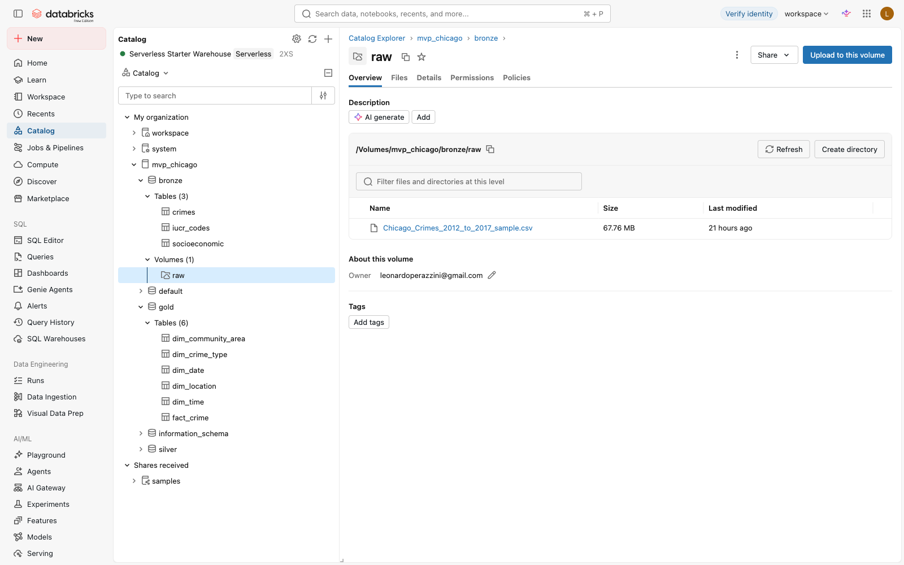
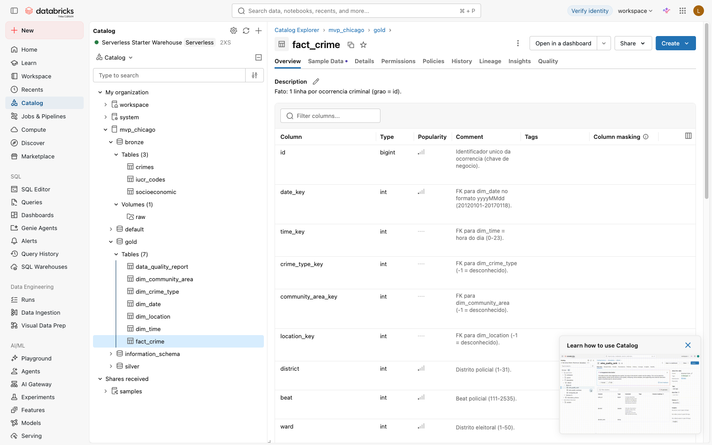
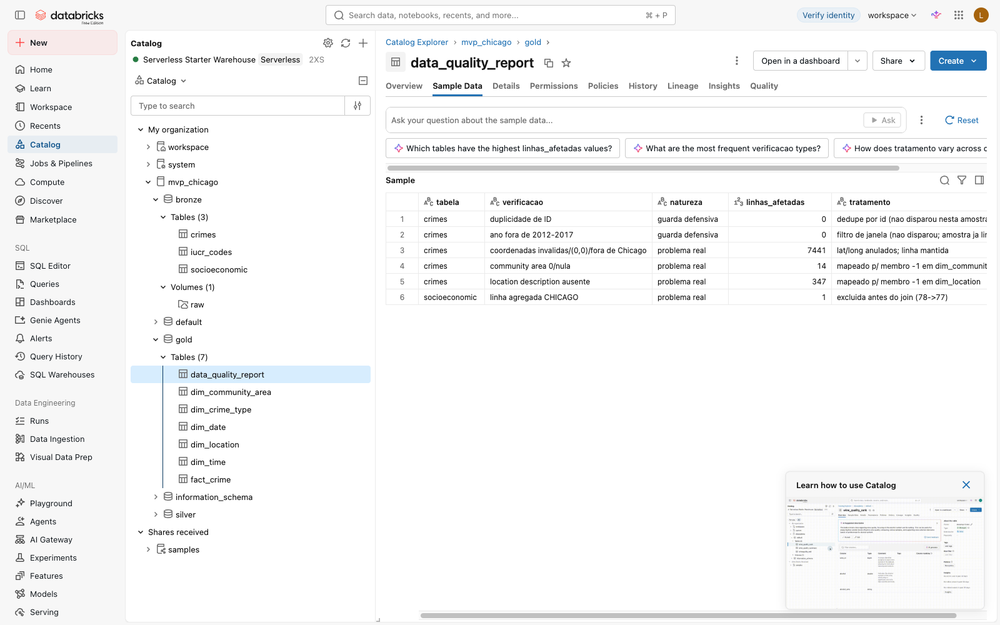
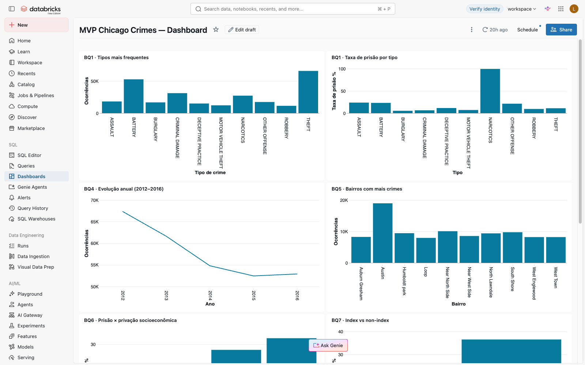

# MVP — Engenharia de Dados

**PUC-Rio · Pós-graduação em Ciência de Dados e Analytics** — Sprint: Engenharia de Dados

Pipeline de dados na nuvem (Databricks Free Edition) sobre criminalidade em Chicago. É o
terceiro MVP de uma sequência sobre a mesma base: os dois primeiros trataram de análise
exploratória e de machine learning; este muda o foco para **engenharia de dados** — montar
um Data Lakehouse confiável, catalogado e consultável, do dado bruto à resposta de negócio.

O pipeline foi **executado de ponta a ponta** no Databricks Free Edition (Unity Catalog +
serverless), com todas as tabelas persistidas. As evidências estão embutidas ao longo deste
documento e em [`evidencias/`](evidencias/).

- **Repositório:** https://github.com/leonardorochaperazzini/mvp-puc-rio-engenharia-de-dados
- **Documentos de apoio:** [objetivo](docs/objetivo.md) · [catálogo de dados](docs/catalogo_de_dados.md) · [linhagem](docs/linhagem.md)

### Arquitetura (medallion + esquema estrela)

```
Kaggle (crimes)  ─┐
Socrata API       ├─►  bronze  ─►  silver  ─►  gold (star schema)  ─►  SQL + Dashboard
(socioeconômico,  ─┘   (bruto)   (limpo/      (fato + dimensões)
 IUCR)                            conciliado)

              dim_date     dim_time
                   \         /
dim_crime_type ──  FACT_CRIME  ── dim_community_area  (+ socioeconômico)
                   /         \
            dim_location    (district/beat/ward)
```

---

## Contexto de Negócios e Perguntas (Etapa 2 e 4.1)

### Problema
Chicago publica o registro de todas as ocorrências criminais da cidade. Esse dado bruto vem
num formato transacional (uma linha por ocorrência, 22 colunas de tipos misturados) que não
é adequado para análise: não há dimensões prontas de tempo/local/tipo, existem duplicidades
e valores inválidos, e nada liga o crime ao contexto socioeconômico do bairro. Este MVP
constrói um pipeline que coleta, limpa, modela em esquema estrela e carrega esses dados num
Data Warehouse, permitindo responder perguntas sobre padrões de criminalidade e de prisão
via SQL e dashboards. O foco **não** é machine learning (assunto dos MVPs 1 e 2).

### Perguntas de negócio
As quatro primeiras continuam as hipóteses (H1–H4) dos MVPs anteriores; as três últimas são
novas e só existem por causa do enriquecimento com fontes externas.

| # | Pergunta | Origem |
|---|----------|--------|
| BQ1 | Quais os tipos de crime mais frequentes e a taxa de prisão de cada um? | H1 |
| BQ2 | Crimes domésticos têm taxa de prisão diferente dos demais? | H2 |
| BQ3 | Existe padrão temporal (hora, turno, dia da semana) na criminalidade e na prisão? | H3 |
| BQ4 | Como a criminalidade evoluiu de 2012 a 2017, e há sazonalidade? | H4 |
| BQ5 | Quais bairros (community areas) concentram mais crimes? | nova |
| BQ6 | Crime e prisão têm relação com indicadores socioeconômicos do bairro? | nova (join) |
| BQ7 | Crimes graves (index, FBI) se distribuem/resolvem diferente dos non-index? | nova (join) |

O documento completo de objetivo (com critérios de sucesso e limitações assumidas antes da
coleta) está em [`docs/objetivo.md`](docs/objetivo.md).

### Estrutura dos dados brutos
Fonte principal — **Chicago Crimes 2012–2017** (amostra de 20%, 291.342 linhas, 22 colunas):

| Coluna bruta | Descrição | Coluna bruta | Descrição |
|---|---|---|---|
| ID | id único da ocorrência | Community Area | bairro (1–77) |
| Case Number | nº do caso | FBI Code | código FBI |
| Date | data/hora | X/Y Coordinate | coordenadas planas |
| Block | quarteirão | Year | ano |
| IUCR | código do crime | Updated On | atualização |
| Primary Type | categoria do crime | Latitude/Longitude | geolocalização |
| Description | descrição | Location | par (lat, long) |
| Location Description | tipo de local | Arrest | houve prisão (bool) |
| Beat / District / Ward | divisões policiais/eleitoral | Domestic | crime doméstico (bool) |

Fontes de enriquecimento: **Socioeconomic Indicators 2008–2012** (77 bairros: renda per
capita, % pobreza, % desemprego, escolaridade, hardship index) e **IUCR Codes** (referência
código → descrição + flag index/non-index).

### Licenças
- **Chicago Crimes:** dataset público no Kaggle (`currie32/crimes-in-chicago`), que
  reempacota dados abertos da Prefeitura de Chicago. Uso permitido conforme os termos do
  Kaggle.
- **Socioeconomic Indicators** e **IUCR Codes:** City of Chicago Data Portal, sob os
  [Terms of Use](https://www.chicago.gov/city/en/narr/foia/data_disclaimer.html) de dados
  abertos da cidade (uso livre com isenção de responsabilidade).

---

## Carga dos Dados (Etapa 4.2)

A coleta usou duas técnicas, ambas trazendo os dados para a nuvem (não para a máquina local):

1. **Chicago Crimes** — upload manual do CSV (amostra de 20%, mesma dos MVPs 1 e 2) para um
   **Volume do Unity Catalog** (`/Volumes/mvp_chicago/bronze/raw`). Optei pela amostra para
   caber nos limites da Free Edition e manter linhagem idêntica às etapas anteriores.
2. **Socioeconômico + IUCR** — coleta programática via **API Socrata**
   (`data.cityofchicago.org`) dentro do notebook `01_bronze_ingestao` (funciona como um
   pequeno robô de coleta; nenhum download manual).

Detalhes e conciliação em [`docs/linhagem.md`](docs/linhagem.md). Evidência do CSV
persistido no Volume, com a árvore bronze/silver/gold à esquerda:



---

## Modelagem e Catálogo de Dados (Etapa 4.3)

Modelagem em **esquema estrela** na camada Gold. Um fato central e cinco dimensões:

| Tabela | Tipo | Grão / conteúdo |
|--------|------|-----------------|
| `fact_crime` | Fato | 1 linha por ocorrência (`id`); FKs para as dimensões + `is_arrest`, `is_domestic`, lat/long |
| `dim_date` | Dimensão | data → ano, mês, trimestre, dia da semana, fim de semana |
| `dim_time` | Dimensão | hora do dia (0–23) e turno |
| `dim_crime_type` | Dimensão | IUCR, primary type, FBI code, **is_index** (fonte IUCR) |
| `dim_community_area` | Dimensão | bairro + **indicadores socioeconômicos** e quartis (fonte socioeconômica) |
| `dim_location` | Dimensão | tipo de local da ocorrência |

Decisões de modelagem: os indicadores socioeconômicos entram como **atributos** de
`dim_community_area` (estrela, não snowflake — 77 linhas não justificam normalizar); cada
dimensão com risco de ausência tem um **membro "-1" (desconhecido)** para não perder fatos.

O **Catálogo de Dados** existe em dois lugares: transcrito em
[`docs/catalogo_de_dados.md`](docs/catalogo_de_dados.md) (descrição, tipo e domínio de cada
campo — mín/máx para numéricos, categorias para categóricos, linhagem) **e** aplicado na
própria plataforma via `COMMENT ON` (todas as 47 colunas gold + comentário nas tabelas
bronze/silver/gold), gerado pelo `pipeline/03_gold_modelagem.py`. Evidência do catálogo vivo
no Unity Catalog:



---

## Pipeline de Dados (Etapa 4.4)

O pipeline é **ramificado em 6 notebooks**, um por etapa (facilita organização e
rastreabilidade), executados em sequência sobre compute serverless:

| Notebook | Papel |
|----------|-------|
| [`00_setup`](pipeline/00_setup.py) | cria catálogo `mvp_chicago`, schemas bronze/silver/gold e o Volume |
| [`01_bronze_ingestao`](pipeline/01_bronze_ingestao.py) | ingestão das 3 fontes como Delta, com metadados de linhagem |
| [`02_silver_limpeza`](pipeline/02_silver_limpeza.py) | tipagem, dedupe, parsing de data, conciliação dos joins |
| [`03_gold_modelagem`](pipeline/03_gold_modelagem.py) | monta o esquema estrela + aplica os `COMMENT ON` |
| [`04_qualidade_dados`](pipeline/04_qualidade_dados.py) | análise de qualidade por atributo + relatório persistido |
| [`05_analise_negocio`](pipeline/05_analise_negocio.py) | consultas SQL das BQ1–BQ7 com discussão |

Cada notebook representa um ou mais processos de ETL (lê de uma camada, transforma, grava na
próxima). Principais transformações documentadas em [`docs/linhagem.md`](docs/linhagem.md),
com destaque para a **conciliação dos joins**: exclusão da linha agregada "CHICAGO" do
socioeconômico (78→77) antes de juntar por community area, e padronização do código IUCR
para 4 dígitos.

Evidência de persistência — as tabelas gravadas como Delta gerenciado no Unity Catalog
(árvore com bronze/silver/gold; a `data_quality_report` é uma tabela Delta gerada pelo `04`):



---

## Qualidade de Dados (Etapa 4.5)

A análise de qualidade roda no `04_qualidade_dados` (perfil por atributo: nulos, distintos,
domínios, duplicidade, cobertura dos joins) e o resultado é **persistido** na tabela
`gold.data_quality_report`. Distingo explicitamente **problema real detectado** de **guarda
defensiva que não disparou** nesta amostra (medido na execução real):

| Tabela | Verificação | Natureza | Linhas | Tratamento |
|--------|-------------|----------|--------|------------|
| crimes | coordenadas inválidas/(0,0)/fora de Chicago | **problema real** | 7.441 | lat/long anulados; linha mantida |
| crimes | location description ausente | **problema real** | 347 | mapeado p/ membro -1 em `dim_location` |
| crimes | community area 0/nula | **problema real** | 14 | mapeado p/ membro -1 em `dim_community_area` |
| socioeconomic | linha agregada "CHICAGO" | **problema real** | 1 | excluída antes do join (78→77) |
| crimes | duplicidade de ID | guarda defensiva | 0 | dedupe por `id` (não disparou nesta amostra) |
| crimes | ano fora de 2012–2017 | guarda defensiva | 0 | filtro de janela (amostra já dentro da janela) |

A amostra é bastante curada (0 duplicatas, 0 registros fora da janela). Mantive as guardas
defensivas no pipeline para robustez caso a base completa seja usada. O único ajuste de
domínio relevante: o corte temporal real dos dados é **2012-01-01 a 2017-01-18** (a origem
trunca em janeiro/2017), por isso 2017 aparece parcial nas análises — isso está refletido no
catálogo e nas discussões.

---

## Análise de Dados (Etapa 4.5)

Consultas SQL sobre o esquema estrela (`05_analise_negocio`) + dashboard nativo do
Databricks. Resultados sobre a amostra de 291.342 ocorrências:

- **BQ1** — THEFT (65,8 mil), BATTERY (52,8 mil) e CRIMINAL DAMAGE (31,2 mil) são os mais
  comuns. A taxa de prisão vai de 99,6% (PROSTITUTION) e 99,3% (NARCOTICS) até 5,3%
  (BURGLARY). **Confirma H1:** a prisão depende da natureza do crime (flagrante × investigação).
- **BQ2** — Crimes domésticos prendem **menos** (19,7%) que os não domésticos (27,0%),
  **contrariando H2**.
- **BQ3** — A noite concentra mais crimes (92,7 mil) e a maior taxa de prisão (30,9%); a
  madrugada, a menor (20,6%). Há padrão temporal, mas **ao contrário do esperado em H3**.
- **BQ4** — Queda de 67,3 mil (2012) para ~53 mil (2016); a taxa de prisão cai de ~28% para
  18,8% em 2016 (2017 truncado na amostra).
- **BQ5** — Austin lidera com folga (≈19 mil), seguido de Near North Side e South Shore.
- **BQ6** — Gradiente claro: o quartil mais vulnerável tem mais crimes (86,1 mil), menor
  renda (US$ 12,7 mil) e maior taxa de prisão (32,3%). Correlação crimes × pobreza = 0,31.
  *Limitação:* indicadores são de 2008–2012, anteriores à maior parte dos crimes — associação
  transversal, não causal.
- **BQ7** — Crimes graves (index) são 41,5% do total mas só 11% terminam em prisão; os
  non-index são 58,5% e prendem 36,5%.

**Síntese:** o fio central é que a chance de prisão depende muito mais da natureza do crime
(flagrante × investigação) do que do volume. Duas hipóteses dos MVPs anteriores (H2 e H3)
não se sustentaram nos dados e foram mantidas e discutidas — os dados corrigindo a intuição
é parte do valor do trabalho. Discussão completa por pergunta no
[`05_analise_negocio`](pipeline/05_analise_negocio.py) e evidência textual em
[`evidencias/resultados_consultas.md`](evidencias/resultados_consultas.md).

Dashboard nativo do Databricks respondendo as 7 perguntas
([publicado](https://dbc-fe5fa4ce-9950.cloud.databricks.com/dashboardsv3/01f1a4db68211e0395d4dd1268dd542d/published);
reproduzível via [`scripts/criar_dashboard.py`](scripts/criar_dashboard.py)):



---

## Autoavaliação

**O que consegui.** O pipeline roda de ponta a ponta no Databricks serverless e cobre todas
as etapas: coleta (upload no volume + API Socrata), modelagem em estrela sobre medallion,
carga com ETL documentado, catálogo de dados (markdown + `COMMENT ON` em todas as colunas
gold) e análise dividida em qualidade e resposta às perguntas. As sete perguntas foram
respondidas por SQL sobre o Data Warehouse, com números na seção de Análise. As quatro
primeiras dão continuidade às hipóteses dos MVPs anteriores — e, curiosamente, duas (H2 e H3)
não se confirmaram, o que rendeu boa discussão.

**O que ficou parcial.** A BQ6, que cruza criminalidade com contexto socioeconômico, é a mais
frágil por um motivo previsto no objetivo: os indicadores são de 2008–2012 e os crimes de
2012–2017. Consigo descrever a associação, mas não afirmar causa nem contemporaneidade.
Preferi manter a pergunta e ser honesto sobre o limite a removê-la.

**Dificuldades.** A maior foi entender a Free Edition, diferente dos tutoriais antigos: não
há DBFS/`FileStore`, tudo passa por Unity Catalog e Volumes, o que mudou a forma de subir e
ler arquivos. A conciliação das fontes também deu trabalho: descobrir a linha agregada
"CHICAGO" inflando o join e tratar os crimes sem community area sem descartá-los.

**Trabalhos futuros.** Buscar indicadores socioeconômicos mais recentes para alinhar o
período e fortalecer a BQ6; rodar com a base completa; adicionar uma dimensão geográfica com
fronteiras para mapas; e evoluir o `04_qualidade_dados` (que já grava um relatório) para
testes automatizados de qualidade a cada carga.

---

## Como reproduzir

1. Crie uma conta no [Databricks Free Edition](https://www.databricks.com/learn/free-edition).
2. Importe a pasta `pipeline/` no workspace (os `.py` importam como notebooks).
3. Rode `00_setup`; baixe o CSV do Chicago Crimes
   ([Kaggle](https://www.kaggle.com/datasets/currie32/crimes-in-chicago)) e faça upload de
   `Chicago_Crimes_2012_to_2017_sample.csv` para o volume `mvp_chicago.bronze.raw`.
4. Execute `01` → `05` (as 2 fontes de enriquecimento são baixadas via API no `01`).
5. Dashboard: rode `python3 scripts/criar_dashboard.py` (com o Databricks CLI autenticado) ou
   monte na mão no SQL Editor a partir das consultas do `05`.

> Uso a amostra de 20% para caber nos limites da versão gratuita e manter linhagem com os
> MVPs anteriores. Para a base completa (~1,45M linhas), basta subir o CSV inteiro no mesmo
> volume — nada mais muda.

## MVPs anteriores (mesma base)
- [Análise de Dados e Boas Práticas](https://github.com/leonardorochaperazzini/mvp-puc-rio-analise-de-dados)
- [Machine Learning & Analytics](https://github.com/leonardorochaperazzini/mvp-puc-rio-ml-analytics)
